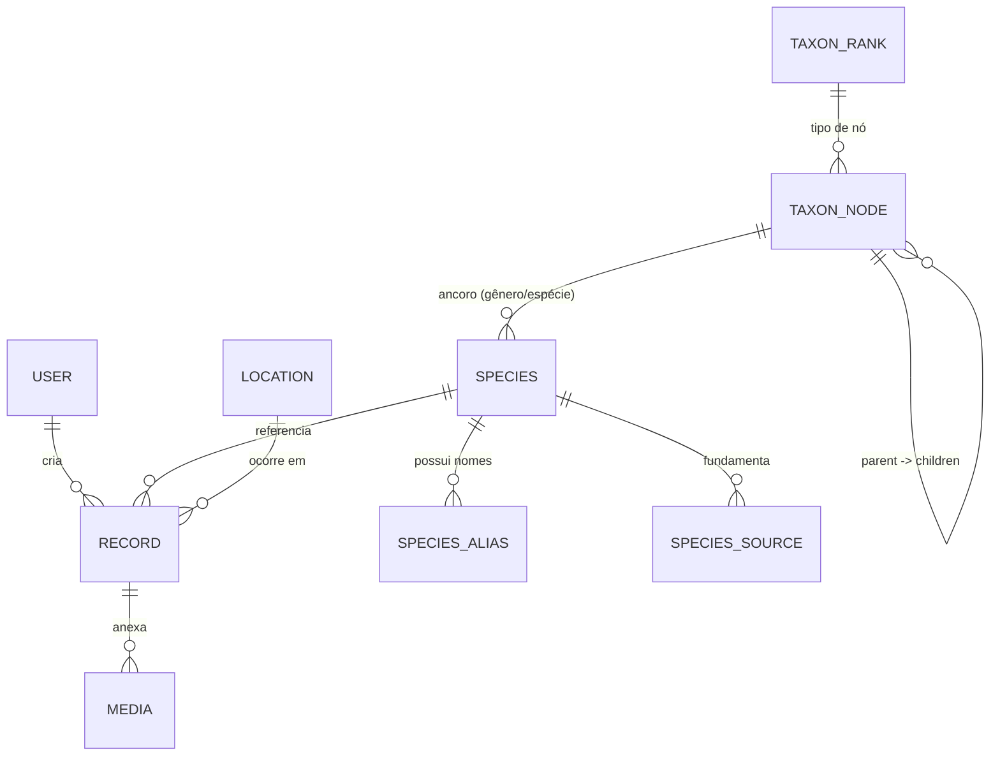

# 🧬 Projeto Thothia — Modelo de Dados (v1)

**Protocolo:** Orion ETO → Fase 🌗 Design  
**Documento:** DATA_MODEL.md  
**Autor:** Bruno | **Data:** 2025-10-23

> Objetivo: estabelecer o modelo relacional mínimo-viável para suportar o MVP de
> catalogação (fauna + flora), com trilhas de evolução para taxonomia completa,
> registros de campo e governança de mídias.

---

## 1) Visão Geral

O modelo organiza **Espécies**, **Taxonomia**, **Registros de Campo** e
**Mídias** em módulos coesos, garantindo:

- rastreabilidade (quem/onde/quando),
- consistência taxonômica,
- flexibilidade para expansão (IA, novas regiões, novas categorias).

---

## 2) Entidades e Relações (ERD)



---

## 3) Tabelas (MVP v1)

### 3.1 `SPECIES`

Representa uma espécie catalogada (fauna ou flora).

| Campo             | Tipo                                                                | Regras                                |
| ----------------- | ------------------------------------------------------------------- | ------------------------------------- |
| id                | UUID (PK)                                                           | gerado                                |
| category          | ENUM(`FAUNA`,`FLORA`)                                               | obrigatório                           |
| common_name       | TEXT                                                                | obrigatório                           |
| scientific_name   | TEXT                                                                | obrigatório, único por projeto        |
| ecological_status | ENUM(`NATIVE`,`ENDEMIC`,`EXOTIC`,`INVASIVE`,`INTRODUCED`,`UNKNOWN`) | default `UNKNOWN`                     |
| taxon_node_id     | UUID (FK→TAXON_NODE.id)                                             | aponta p/ nó taxonômico (ex.: gênero) |
| description       | TEXT                                                                | opcional                              |
| created_at        | TIMESTAMP                                                           | auto                                  |
| updated_at        | TIMESTAMP                                                           | auto                                  |

**Observações**:

- `scientific_name` é a referência canônica; `SPECIES_ALIAS` cobre
  variações/nomes populares locais.

---

### 3.2 `SPECIES_ALIAS`

Nomes alternativos de uma espécie.

| Campo      | Tipo                 | Regras                |
| ---------- | -------------------- | --------------------- |
| id         | UUID (PK)            |                       |
| species_id | UUID (FK→SPECIES.id) | obrigatório           |
| alias      | TEXT                 | obrigatório           |
| locale     | TEXT                 | ex.: `pt-BR`, `en-US` |

---

### 3.3 `SPECIES_SOURCE`

Referências usadas para identificar/classificar a espécie (ciência aberta).

| Campo      | Tipo                 | Regras                                         |
| ---------- | -------------------- | ---------------------------------------------- |
| id         | UUID (PK)            |                                                |
| species_id | UUID (FK→SPECIES.id) | obrigatório                                    |
| title      | TEXT                 | título/obra                                    |
| url        | TEXT                 | link (GBIF, iNaturalist, Flora do Brasil etc.) |
| citation   | TEXT                 | citação breve/ABNT opcional                    |

---

### 3.4 `TAXON_RANK`

Enumera níveis taxonômicos aceitos.

| Campo | Tipo                                                                | Regras |
| ----- | ------------------------------------------------------------------- | ------ |
| id    | UUID (PK)                                                           |        |
| name  | ENUM(`KINGDOM`,`PHYLUM`,`CLASS`,`ORDER`,`FAMILY`,`GENUS`,`SPECIES`) | único  |

---

### 3.5 `TAXON_NODE`

Árvore taxonômica (cada nó representa um táxon).

| Campo     | Tipo                    | Regras                                                               |
| --------- | ----------------------- | -------------------------------------------------------------------- |
| id        | UUID (PK)               |                                                                      |
| rank_id   | UUID (FK→TAXON_RANK.id) | obrigatório                                                          |
| name      | TEXT                    | obrigatório (ex.: `Aves`, `Passeriformes`, `Tyrannidae`, `Pitangus`) |
| parent_id | UUID (FK→TAXON_NODE.id) | nulo no topo                                                         |
| notes     | TEXT                    | opcional                                                             |

**Padrão:** `parent_id` liga nós (árvore). **Espécies:** podem apontar para o nó
de **GÊNERO** (campo `taxon_node_id`), guardando o `scientific_name` completo na
`SPECIES`.

---

### 3.6 `RECORD`

Registro de campo (observação + metadados).

| Campo       | Tipo                  | Regras                                |
| ----------- | --------------------- | ------------------------------------- |
| id          | UUID (PK)             |                                       |
| species_id  | UUID (FK→SPECIES.id)  | obrigatório                           |
| user_id     | UUID (FK→USER.id)     | opcional (multi-observador futuro)    |
| observed_at | TIMESTAMP             | obrigatório                           |
| location_id | UUID (FK→LOCATION.id) | recomendado                           |
| weather     | TEXT                  | opcional                              |
| environment | TEXT                  | ex.: costeiro, restinga, urbano, mata |
| notes       | TEXT                  | observações livres                    |
| created_at  | TIMESTAMP             | auto                                  |

---

### 3.7 `MEDIA`

Mídias anexadas ao registro (foto, áudio).

| Campo      | Tipo                  | Regras                       |
| ---------- | --------------------- | ---------------------------- |
| id         | UUID (PK)             |                              |
| record_id  | UUID (FK→RECORD.id)   | obrigatório                  |
| type       | ENUM(`IMAGE`,`AUDIO`) | obrigatório                  |
| uri        | TEXT                  | obrig. (ex.: URL Cloudinary) |
| exif_json  | JSON                  | metadados EXIF               |
| alt_text   | TEXT                  | acessibilidade               |
| created_at | TIMESTAMP             | auto                         |

---

### 3.8 `LOCATION`

Localizações aproximadas, reusáveis.

| Campo       | Tipo         | Regras                                |
| ----------- | ------------ | ------------------------------------- |
| id          | UUID (PK)    |                                       |
| name        | TEXT         | ex.: “Praia de Palmas – costão norte” |
| lat         | NUMERIC(9,6) | opcional (privacidade ecológica!)     |
| lng         | NUMERIC(9,6) | opcional                              |
| precision_m | INT          | raio/precisão aproximada              |
| notes       | TEXT         |                                       |

---

### 3.9 `USER` (futuro)

Multi-usuários/colaboradores.

| Campo        | Tipo                                 | Regras |
| ------------ | ------------------------------------ | ------ |
| id           | UUID (PK)                            |        |
| display_name | TEXT                                 |        |
| email        | TEXT                                 | único  |
| role         | ENUM(`OWNER`,`CONTRIBUTOR`,`VIEWER`) |        |

---

## 4) Enums (sugestão Prisma)

```ts
enum Category { FAUNA FLORA }
enum EcologicalStatus { NATIVE ENDEMIC EXOTIC INVASIVE INTRODUCED UNKNOWN }
enum MediaType { IMAGE AUDIO }
enum Role { OWNER CONTRIBUTOR VIEWER }
```

---

## 5) Índices & Integridade

- `SPECIES(scientific_name)` → UNIQUE
- `RECORD(species_id, observed_at)` → INDEX (consulta por espécie/tempo)
- `TAXON_NODE(parent_id, name)` → UNIQUE dentro do mesmo ramo
- FKs `ON DELETE RESTRICT` p/ taxonomia; `ON DELETE CASCADE` p/ mídias de
  `RECORD`

---

## 6) Sementes (seed) iniciais

- `TAXON_RANK`: inserir níveis canônicos.
- Nós raiz por Reino (`Animalia`, `Plantae`, `Fungi`) para guiar cadastro.

---

## 7) Trilhas de Evolução

- **GBIF/iNaturalist**: importadores para sugerir taxonomia.
- **IA (Visão Computacional)**: campo `ml_label`/`ml_confidence` em `RECORD` ou
  `MEDIA`.
- **Geoprivacidade**: mascarar coordenadas sensíveis por espécie/status.
