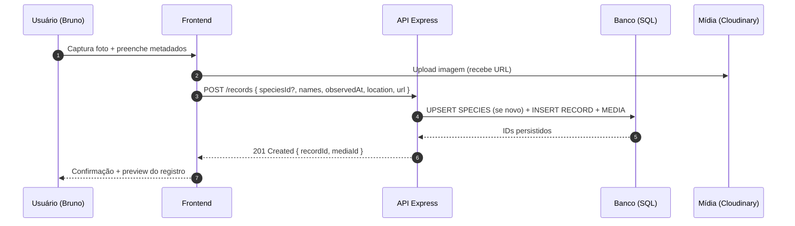
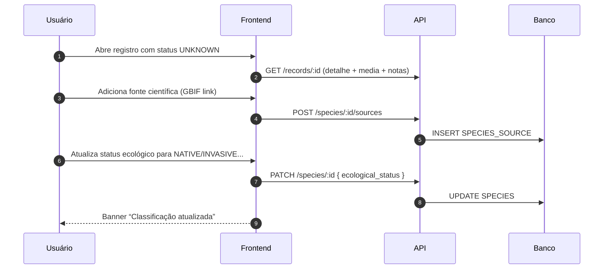

# SYSTEM FLOW

🧭 Projeto Thothia — Fluxo do Sistema (v1) **Protocolo:** Orion ETO → Fase 🌗
Design  
**Documento:** SYSTEM_FLOW.md  
**Autor:** Bruno | **Data:** 2025-10-23

> Objetivo: descrever os percursos críticos do MVP (cadastro, consulta,
> pesquisa) e orientar integração entre frontend, API e banco.

---

## 1) Arquitetura Lógica (MVP)

- **Frontend (React+TS+Vite+Tailwind)**: UI de registro/consulta.
- **API (Node+Express)**: REST modular por entidade.
- **DB (PostgreSQL/SQLite + Prisma)**: persistência e migrações.
- **Mídia (Cloudinary/local)**: armazenamento de imagens c/ EXIF.

---

## 2) Fluxos Principais

### 2.1 Registrar Observação (campo → app)



Notas

- Se espécie ainda não existir: FE envia scientific_name/common_name e category;
  API faz UPSERT em SPECIES.
- Localização usa LOCATION reusável ou inline para depois normalizar.

### 2.2 Navegar & Filtrar Catálogo

- Filtros: categoria (fauna/flora), status ecológico, habitat/ambiente, texto.
- Paginação por registros mais recentes e por espécie.

```mermai
sequenceDiagram
  autonumber
  participant FE as Frontend
  participant API as API
  participant DB as Banco

  FE->>API: GET /species?filters...
  API->>DB: SELECT SPECIES (JOIN TAXON_NODE, AGG records)
  DB-->>API: Lista paginada
  API-->>FE: JSON (itens + contagem)
  FE-->>FE: Render cards + filtros ativos
```

### 2.3 Ciclo de Pesquisa & Classificação



## 3) Endpoints (esqueleto MVP)

**Species**:

- GET /species (filtros: q, category, status, rank, parentNode)
- GET /species/:id
- POST /species (admin/dev)
- PATCH /species/:id (atualizar ecological_status, description)
- GET /taxonomy/:nodeId/children

**Records**:

- GET /records (filtros: speciesId, dateFrom, dateTo, env)
- GET /records/:id
- POST /records (criar registro + mídias)
- POST /records/:id/media (adicionar mídia)

**Auxiliares**:

- GET /locations / POST /locations
- POST /species/:id/sources
- GET /stats/overview (contagens por categoria/status)

## 4) Estados de UI (MVP)

- Lista de Espécies: cards com nome, status, contagem de observações, miniatura.
- Detalhe de Espécie: galeria, taxonomia, mapa aproximado, fontes.
- Novo Registro: formulário focado e rápido (upload primeiro, dados depois).
- Pesquisa: barra “omni-filter” (texto + chips de filtros).

## 5) Segurança & Ética

- Anonimizar coordenadas para espécies sensíveis ou ninhais.
- Restringir edição de taxonomia a papéis OWNER/CONTRIBUTOR.
- Guardar `exif_json` apenas se consentido (privacidade).

## 6) Evolução

- GraphQL para consultas agregadas.
- Cache (HTTP/ETag) em listagens de espécie.
- IA de identificação (fila assíncrona e revisão humana).
- Mapas (heatmap por espécie/tempo).

---
