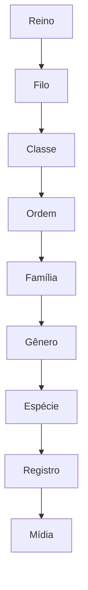

# 🐦 Projeto Thothia — Mapa Taxonômico Inicial

**Protocolo:** Orion ETO → Fase 🌗 Design  
**Documento:** TAXONOMIC_MAP.md  
**Autor:** Bruno | **Data:** 2025-10-23

> Objetivo: apresentar exemplos reais de hierarquias taxonômicas que servirão de
> base para semear o banco de dados e validar consultas.

---

## 1) Estrutura Hierárquica Geral

O sistema taxonômico segue o modelo clássico (de cima para baixo):

```txt
Reino -> Filo -> Classe -> Ordem -> Familia -> Gênero -> Espécie
```

Os três reinos inicialmente contemplados serão:

| Reino        | Abrangência                                         | Exemplo                |
| ------------ | --------------------------------------------------- | ---------------------- |
| **Animalia** | Aves, mamíferos, insetos, répteis, peixes etc.      | _Pitangus sulphuratus_ |
| **Plantae**  | Árvores, arbustos, gramíneas, algas multicelulares. | _Inga vera_            |
| **Fungi**    | Cogumelos, líquens, bolores.                        | _Pleurotus ostreatus_  |

---

## 2) Exemplo: Aves (Animalia → Chordata → Aves)

| Nível   | Nome                   | Observações                                      |
| ------- | ---------------------- | ------------------------------------------------ |
| Reino   | Animalia               | Animais multicelulares                           |
| Filo    | Chordata               | Vertebrados                                      |
| Classe  | Aves                   | Animais com penas e ovos com casca               |
| Ordem   | Passeriformes          | Maioria das aves canoras                         |
| Família | Tyrannidae             | Bem-te-vis e afins                               |
| Gênero  | _Pitangus_             |                                                  |
| Espécie | _Pitangus sulphuratus_ | “Bem-te-vi” — comum em áreas urbanas e costeiras |

---

## 3) Exemplo: Planta (Plantae → Magnoliophyta → Liliopsida)

| Nível   | Nome          | Observações                              |
| ------- | ------------- | ---------------------------------------- |
| Reino   | Plantae       | Plantas verdes, autotróficas             |
| Filo    | Magnoliophyta | Angiospermas                             |
| Classe  | Liliopsida    | Monocotiledôneas                         |
| Ordem   | Poales        | Gramíneas e afins                        |
| Família | Poaceae       | Família das gramas                       |
| Gênero  | _Zea_         |                                          |
| Espécie | _Zea mays_    | Milho — espécie domesticada, introduzida |

---

## 4) Exemplo: Fungo (Fungi → Basidiomycota → Agaricomycetes)

| Nível   | Nome                  | Observações                            |
| ------- | --------------------- | -------------------------------------- |
| Reino   | Fungi                 | Seres decompositores                   |
| Filo    | Basidiomycota         | Produzem esporos em basídios           |
| Classe  | Agaricomycetes        | Cogumelos comestíveis                  |
| Ordem   | Agaricales            | Maioria dos cogumelos conhecidos       |
| Família | Pleurotaceae          |                                        |
| Gênero  | _Pleurotus_           |                                        |
| Espécie | _Pleurotus ostreatus_ | “Shimeji” — fungo comestível cultivado |

---

## 5) Relações Internas no Banco (referência Prisma)



---

## 6) Escalabilidade

- Novo Reino pode ser adicionado sem ruptura.
- Subníveis opcionais (Subordem,Subfamília, Variedade) podem ser ativados
  depois.
- Cada Espécie mapeia seu nó terminal, mas pode ser filtrada por qualquer
  ancestral.

“A árvore taxonômica de Thothia cresce como a natureza — cada folha é um
registro de vida.”
